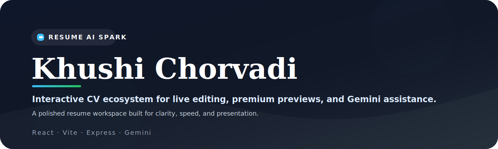

# Resume AI Spark



A focused resume builder and presentation workspace for Khushi Chorvadi. It combines a live resume editor, a print-ready preview (PDF/print CSS friendly), and optional Supabase-backed storage. The backend proxies Google Gemini (AI) calls for assistant-driven feedback and rewrite suggestions.

## Features

- Live WYSIWYG resume editor with instantaneous preview updates.
- Print-focused layout controls for spacing, typography, and density.
- Gemini-powered AI assistant for feedback and rewrite suggestions (server-side).
- Optional Supabase integration for persisting profiles and resumes.
- Export/print-friendly output for producing a clean PDF or paper resume.

## Quick start

Prerequisites: Node 18+, npm.

1. Install dependencies

```bash
npm install
```

2. Copy the example env and fill values

```bash
cp .env.example .env
# then edit .env and set GEMINI_API_KEY, VITE_SUPABASE_URL, VITE_SUPABASE_ANON_KEY as needed
```

3. Run in development

```bash
npm run dev
```

Open http://localhost:3000 (or the port shown by the server) to view the app.

## Environment variables

The project uses environment variables for the AI backend and (optional) Supabase:

- `GEMINI_API_KEY` — Google Gemini / Google AI Studio API key (required for AI features).
- `APP_URL` — public URL of the app (used for callbacks or links; optional in local dev).
- `VITE_SUPABASE_URL` — Supabase project URL (optional; required only if using Supabase features).
- `VITE_SUPABASE_ANON_KEY` — Supabase anon key (optional; required only if using Supabase features).

There is a `.env.example` file showing the shape of these variables.

## Scripts

- `npm run dev` — Start the development server (`tsx server.ts`), runs Express + Vite middleware.
- `npm run build` — Build the frontend and bundle the server (`vite build` + `esbuild` bundle).
- `npm start` — Start the production server from `dist/server.cjs`.
- `npm run lint` — Type-check the TypeScript sources.
- `npm run clean` — Remove `dist` and build artifacts.

Tools included:

- `scripts/check-supabase.mjs` — small helper that validates Supabase connectivity (reads `VITE_SUPABASE_*` from environment).
- `supabase-schema.sql` — optional schema to initialize `profiles` / `resumes` tables if you use Supabase.

## Supabase (optional)

If you plan to enable persistent storage and authentication using Supabase:

1. Create a Supabase project and copy `VITE_SUPABASE_URL` and `VITE_SUPABASE_ANON_KEY` into `.env`.
2. Optionally run the SQL in `supabase-schema.sql` to create the tables used by the project.
3. Use `node scripts/check-supabase.mjs` to validate connectivity:

```bash
node scripts/check-supabase.mjs
```

The frontend reads Supabase config from `import.meta.env` via `src/supabaseClient.ts` and will disable Supabase UI when not configured.

## Project layout

- `index.html` — app shell and favicon reference.
- `src/` — React application sources:
	- `App.tsx`, `main.tsx` — entry points
	- `components/` — `DigitalDashboard`, `LatexPrintView`, `ResumeDataEditor`
	- `supabaseClient.ts` — optional Supabase client wrapper
	- `initialData.ts`, `utils.ts`, `types.ts` — helpers and types
- `server.ts` — small Express server that proxies Gemini calls and serves built assets in production.
- `scripts/` — utility scripts (e.g., `check-supabase.mjs`).

## Build & deploy

1. Build for production:

```bash
npm run build
```

2. Serve the built server in `dist/`.

```bash
npm start
```

For deployment, ensure `GEMINI_API_KEY` and any Supabase env vars are provided in your hosting environment's secret manager.

## Development notes

- The dev server uses `tsx` to run `server.ts` with Vite middleware for HMR.
- If you are not using the Gemini AI features, you can run without `GEMINI_API_KEY` but AI-powered assistant UI will be disabled.
- Tailwind and Vite are configured in the project; run `npm run dev` to get the full hot-reload experience.

## Contributing

Open an issue or PR if you want to improve features, fix bugs, or adjust the resume templates.


